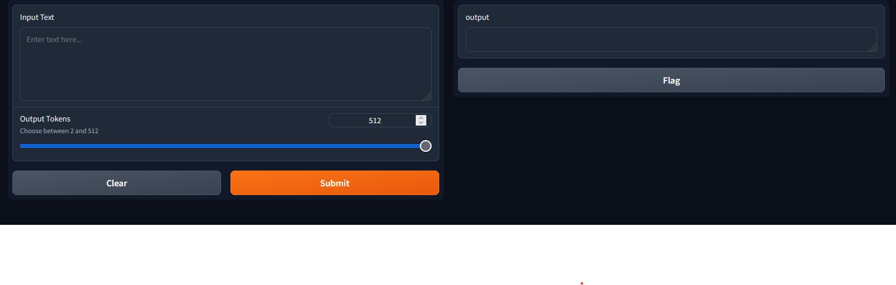

# EMLOv3 | Assignment 09

## GPT on Harry Potter text deployed on AWS
- The trained model checkpoint is stored in S3, to be accessed using 'aws_access_key_id' & 'aws_secret_access_key'.
- The gpt_jit model is deployed as Fargate spot container deployment on AWS ECS.
- The deployment url is updated on 'deployment.json'.
- Demo Web UI (Gradio) must run on port 80 and should be publicly accessible.

## To run demo

- Access the url in deployment.json

## Author

- Vikas Jha